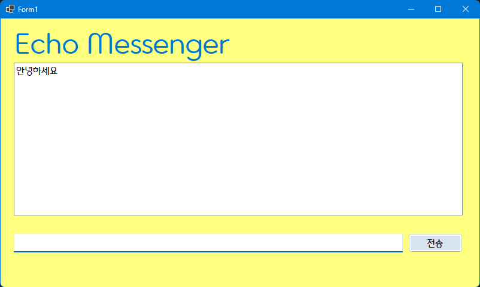

# (C# 코딩) 에코 메신저
## 개요
- C# 프로그래밍 학습
- 핵심기능:
- 화면구성: 
## 실행 화면
- 1단계 코드의 실행 스크린샷

초기화면

메세지박스를 클릭하면 "문자를 입력하세요" 사라짐

전송버튼을 누르면 리스트박스로 메세지전송, 기존 메세지 삭제

## 실행 화면 (과제2)
- 과제2 코드의 실행 스크린샷

- 과제 내용
- 3단계 코드의 실행 스크린샷

- 4단계 코드의 실행 스크린샷

## 배운 내용
